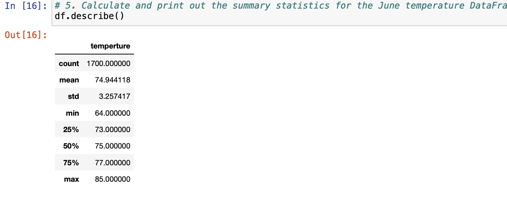
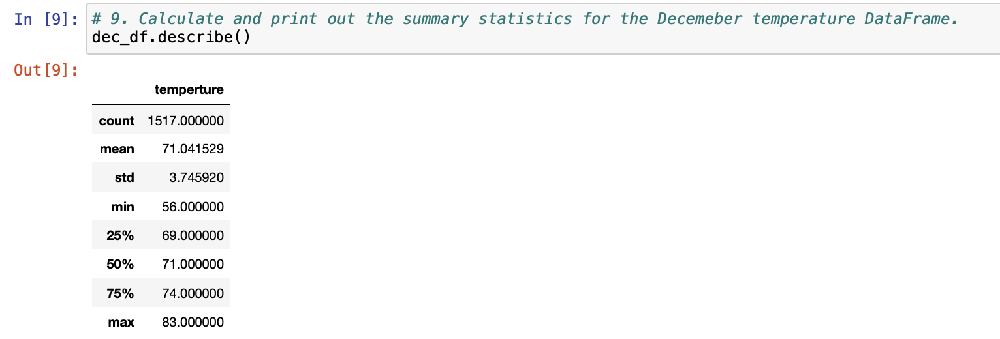
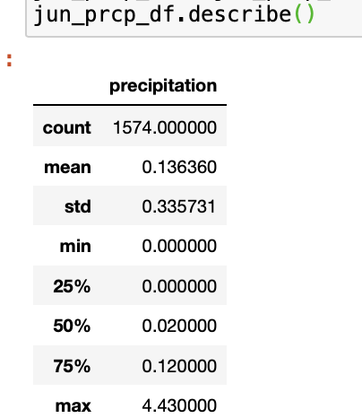
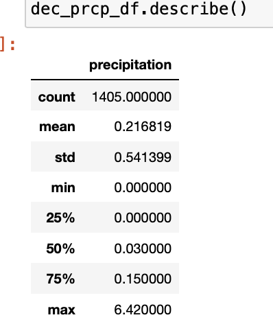

# Surfs Up
## Overview
A company is trying to determine the viability and sustainability of an ice cream shop in Oahu, HI year round.  This analysis willl use one year of temperture data for Oahu and determine the statistics for the months of June and December.

## Setup for Analysis
Using the Python SQL toolkit and Object Relational Mapper we create an engine that connects to the hawaii.sqlite file.  This file contains the information about the weather in Hawaii.  There are two tables, measurement and station.  The measurement table is the one we are most interested in for this analysis.  The table consists of the following columns: __tobs, prcp, station, date and id__.  The tobs column provides us with the temperture reading and the prcp column is precipitation.  The station is the weather station where the reading was taken and the date is the day the reading was taken.  

For this analysis we create an empty list to capture the June temps for all the years of the data.  Then query the database on the date and tobs column, extracting just the information for the month of June (6).  Then the list is used to create a DataFrame and from that the dt.describe() function provides the information desired.  This is the code:
<br>
```
# Convert the June temperatures to a list.
june_temps = []
june_temps = session.query(Measurement.date, Measurement.tobs).filter(extract('month', Measurement.date)==6).all()

# Create a DataFrame from the list of temperatures for the month of June. 
df = pd.DataFrame(june_temps, columns=['date','temperture'])
df.set_index(df['date'], inplace=True)
df = df.sort_index()
df.describe()
```

We can then refactor the code above and change this as follows for December (12):
```
# Convert the Dec temperatures to a list.
dec_temps = []
dec_temps = session.query(Measurement.date, Measurement.tobs).filter(extract('month', Measurement.date)==12).all()

# Create a DataFrame from the list of temperatures for the month of Dec. 
dec_df = pd.DataFrame(dec_temps, columns=['date','temperture'])
dec_df.set_index(dec_df['date'], inplace=True)
dec_df = df.sort_index()
dec_df.describe()
```

## Results
The results for the June temperatures are: <br>
  

The results for the December temperatures are: <br>
  

The three key findings between the temperatures in June and Dec are:
* June's min is 64 and Dec's min is 56 so there is 9 degree difference between the minimum tempertures. 
* June's max is 85 and Dec's max is 83 so these are very close, although we can see that Dec's 83 is much greater then 75% and less likely to occur.
* The average temps are 71 and 75 degrees.  Only 4 degrees different from summer to winter.  Very moderate weather year round.

## Additional Queries
Because the weather is pretty much the same year round it would be helpful for the client to know what the precipitation is in the months of June and Dec. By refactoring the code above for June and looking at the Measurement.prcp data instead of the tobs we get the statistics for June rainfall here:<br>
<br>


Here's it the average rainfall for December:<br>
<br>

<br>
The three key findings between the precipitation in June and Dec are:
* June and Dec's 25% quartile are both 0 which being from the midwest seems to be surprising but Hawaii's weather is much different then the Midwest. 
* June's max is 4.43 inches and Dec's max is 6.42 inches and 2 inches of rain can be a lot when it doesn't rain much. 
* The average precipitation is extremely close.  June is .13 and Dec is .21 inches.  Less than an inch difference from summer to winter.
<br>

## Conclusion
The client requested information about how the weather might affect the sale of ice cream in June and December in Oahu.  The findings from the analysis help us to conclude that for the most part the temperture will be on average year round between 71 and 75 degrees and rainfall will be on average between a tenth and two tenths of an inch.  So the conclusion would be that weather will not be a factor in opening an Ice Cream shop in Maui.
